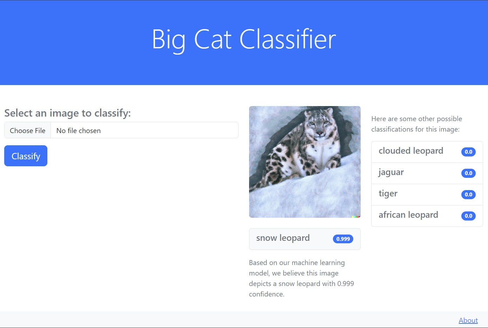

# Big Cats Classification 🐅🐆🦁

A minimalist web app built using flask that classifies images using the huggingface inference api.
This model achieves 98% accuracy on the testing set. The underlying architecture is a vision transformer from the paper an image is worth 16x16 words. 

# References

Kaggle dataset: https://www.kaggle.com/datasets/gpiosenka/cats-in-the-wild-image-classification

Huggingface model: https://huggingface.co/therealcyberlord/bigcatvit
